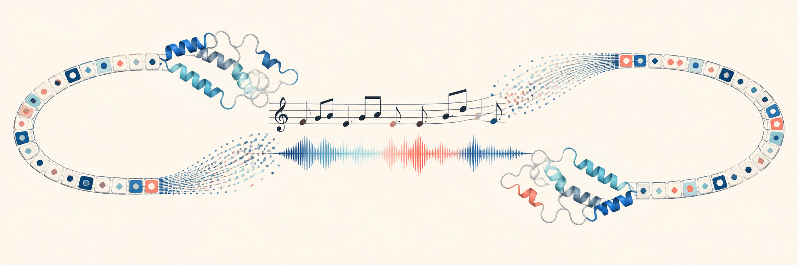

# Seq2Music

> Turn protein, DNA, and RNA into audible, visible, reversible music—and back again—in Codex.



Seq2Music is a local-first Codex plugin and standalone Python tool for exploring biological sequences through sound and musical notation. It creates synchronized MIDI, WAV, MusicXML, accessible scores, browser playback, and event-level data. Exact carriers decode back to the normalized source sequence; supported audio and scores can also be transcribed into sequences using protein, DNA, or RNA alphabets.

It also renders sequence differences, multiple-sequence alignments, and structure-derived residue traces as coordinated music and visuals—all offline.

## Highlights

- Lossless normalized-sequence round trips through self-describing MIDI, PCM WAV, and MusicXML.
- Explicitly lossy transcription from metadata-free PCM WAV and plain MusicXML.
- Codex-assisted import from common music and video files when a local audio converter is available.
- Protein, DNA, and RNA alphabets.
- Audible reference/variant diffs, alignment summaries, and residue-order structure traces.
- Accessible SVG notation, HTML playback, CSV event ledgers, and SHA-256 manifests.
- Offline implementation using Python's standard library.
- Streamed WAV rendering with adjustable resource budgets and no preview-duration ceiling.

## Install in Codex

Install the tagged GitHub marketplace and then install Seq2Music:

```bash
codex plugin marketplace add jvogan/seq2music --ref v0.3.2
codex plugin add seq2music@seq2music
```

Start a new Codex task after installation so Codex discovers the plugin skill. No account, API key, or network service is required by Seq2Music itself.

For local development from a clone, run `codex plugin marketplace add .` from the repository root instead.

To remove it:

```bash
codex plugin remove seq2music@seq2music
codex plugin marketplace remove seq2music
```

## Run the CLI directly

Python 3.10 or newer is required. From the repository root:

```bash
python3 plugins/seq2music/scripts/seq2music.py encode \
  --input plugins/seq2music/assets/examples/demo-protein.fasta \
  --kind protein \
  --out seq2music-output
```

The command creates a deterministic bundle containing MIDI, PCM WAV, MusicXML, accessible SVG notation, HTML, a CSV event ledger, a text summary, and a JSON run manifest.

## Data handling

All processing is local. Exact MIDI remains recoverable through its ordered notes and interpretation metadata; exact WAV and MusicXML also carry embedded sequence metadata. Sharing any exact carrier can therefore share the underlying sequence. See [PRIVACY.md](PRIVACY.md) for the complete data-handling summary.

Seq2Music supports macOS, Linux, and Windows. On platforms without secure directory-descriptor operations, new output works normally while `--force` replacement is disabled; choose a new output path instead.

## Verify the repository

```bash
python3 scripts/public_release_audit.py
python3 -m unittest discover -s plugins/seq2music/tests -v
```

The release audit checks the portable marketplace layout, manifest assets, common credential patterns, private absolute paths, symlinks, generated caches, and oversized files.

## Repository layout

```text
.
├── .agents/plugins/marketplace.json
├── plugins/seq2music/
│   ├── .codex-plugin/plugin.json
│   ├── assets/
│   ├── scripts/seq2music.py
│   ├── skills/sonify-biomolecules/
│   └── tests/
└── scripts/public_release_audit.py
```

Detailed mappings, codec statuses, supported inputs, and scientific references are documented inside the plugin at [`plugins/seq2music/README.md`](plugins/seq2music/README.md) and [`plugins/seq2music/skills/sonify-biomolecules/references/`](plugins/seq2music/skills/sonify-biomolecules/references/).

Release changes are recorded in [CHANGELOG.md](CHANGELOG.md). The public [OpenAI Plugins Directory submission packet](submission/README.md) contains the listing copy, starter prompts, and reproducible activation tests.

## License

MIT © 2026 Jacob Vogan. See [LICENSE](LICENSE). Use of the published plugin is also described in [TERMS.md](TERMS.md).
